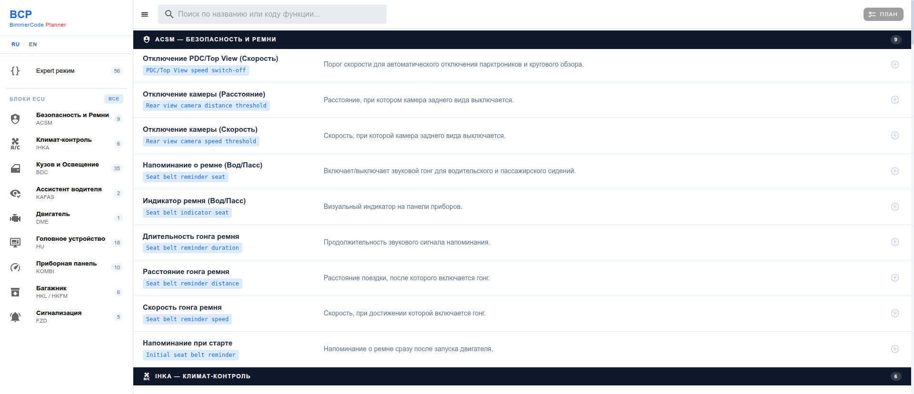

# BCP — BimmerCode Planner

A BMW coding reference and plan builder for use with the BimmerCode app.

**Live:** https://bimmercode.netlify.app/

## Screenshots




## Features

- **Simple mode** — ECU parameter catalog (ACSM, BDC, KOMBI, HU, FRM, etc.). Pick what you need, build a plan.
- **Expert mode** — step-by-step guides for multi-block codings: hex values, parameter paths, notes.
- **Coding plan** — collected parameters from both modes, copy to clipboard in one click.
- **Search** — by name, parameter code, or description; scoped to the active mode.
- **i18n** — Russian and English UI, language choice persisted in localStorage.
- **Persistence** — selection survives page reloads via localStorage.

## Stack

- Vue 3 + TypeScript (Composition API, `<script setup>`)
- Vite 5
- Vuetify 3 (tree-shaken via vite-plugin-vuetify)
- Pinia
- vue-i18n v9
- ESLint 9 (flat config) + Prettier

## Getting Started

```bash
npm install
npm run dev
```

## Scripts

| Command | Description |
|---|---|
| `npm run dev` | Start dev server |
| `npm run build` | Type-check + production build |
| `npm run preview` | Preview production build |
| `npm run lint` | Run ESLint |
| `npm run lint:fix` | Run ESLint with auto-fix |

## Structure

```
src/
  components/
    expert/       — expert mode cards and view
    plan/         — plan dialog
    selector/     — simple mode rows and view
    TheAppBar.vue
    TheSidebar.vue
    BchToast.vue
  data/
    parameters.ts — parameter database (simple + expert)
  i18n/
    locales/      — ru.ts, en.ts
    index.ts      — vue-i18n setup
  stores/
    plan.ts       — selection state (Pinia)
    ui.ts         — drawer, tabs, search, toast (Pinia)
  types/
    index.ts      — shared TypeScript interfaces
```

## License

GNU General Public License v3.0
